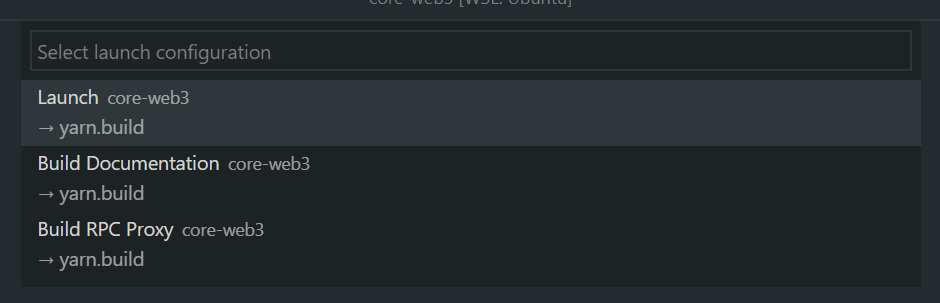
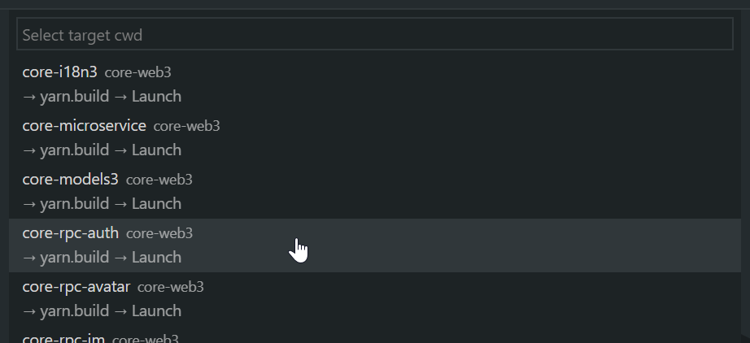

## About

This extension tries to solve debug/launch configuration and task duplication
when working in multi-project environments, like monorepos or multi-folder
workspaces, in VS Code.

The core approach is to execute launch configurations and tasks in dynamically
selected working directories.

Instead of redefining the same launch configurations over and over, define them
once generically and let MonoLit handle the rest.

## Usage

To get started, invoke the `monolit.ignite` command. You should be guided from there. **The documentation below is outdated.**

Invoke the `monolit.start` command to get started.

MonoLit presents a list of "monolit-able" launch configurations. A launch
configuration becomes monolit-able if any of the following are true:

-   The `cwd` of the configuration contains a `*`.
-   The `program` of the configuration contains a `*`.
-   The name starts with `MonoLit:`.



The highlighted portion shows the name of the configuration. Next to it is the
name of the workspace this configuration was found in.
On the second line you see the `preLaunchTask` set in the configuration, if any.

MonoLit will then check the `cwd` in the configuration and expand the glob
pattern therein. For example, your `cwd` is configured as:

```json
  "cwd": "${workspaceFolder}/packages/*"
```

It will then look for matches in all open workspace folders and present the
findings, for you to select a target for this launch.



MonoLit will then launch your configuration in the newly selected working
directory.
If your `program` in the configuration also contains the same path as your `cwd`
, that part is also replaced by the new `cwd`, so the correct program is
launched.

## Example

Let's assume you have an existing launch configuration for a specific project:

```json
{
    "type": "node",
    "request": "launch",
    "name": "Launch Web Worker",
    "preLaunchTask": "yarn.build",
    "program": "${workspaceFolder}/packages/app-web/source/main.ts",
    "runtimeArgs": ["…"],
    "cwd": "${workspaceFolder}/packages/app-web"
}
```

As you expand your monorepo, you may start to duplicate this configuration,
either in the root or in individual projects.
Rewrite this configuration to be generic, so you can use it with MonoLit, like
so:

```json
{
    "type": "node",
    "request": "launch",
    "name": "Launch",
    "preLaunchTask": "yarn.build",
    "program": "${workspaceFolder}/packages/app-*/source/main.ts",
    "runtimeArgs": ["…"],
    "cwd": "${workspaceFolder}/packages/app-*"
}
```

Now when you launch `monolit.start`, the same configuration can be used for
every project matching `${workspaceFolder}/packages/app-*`.

## Pre-Launch Tasks

MonoLit's dynamic adjustment of pre-launch tasks is a key feature that should
not be overlooked.
By executing a _targetted build_ approach in the `cwd` of the target project,
one can ensure only the required source files are built for this launch.
This can be as simple as executing [`yarn.build`](https://yarn.build/) in the
task. For example:

```json
{
    "label": "yarn.build",
    "type": "shell",
    "command": ["yarn", "build"],
    "problemMatcher": ["$tsc"],
    "group": {
        "kind": "build",
        "isDefault": true
    }
}
```

Additionally, by configuring a _rebuild_ command (`monolit.tasks.rebuild`) in
your settings, you can use the `monolit.cleanStart` command to have that task
executed as the pre-launch task of the started configuration.

This enables workflows with a fast default build (change detection, incremental,
...) and a slower full rebuild.

## Workflows

-   `monolit.start` <kbd>F5</kbd>  
    Start a new session.
-   `workbench.action.debug.restart` <kbd>Ctrl</kbd>+<kbd>Shift</kbd>+<kbd>F5</kbd>  
    Restart the session without running the pre-launch task.
-   `monolit.restart` <kbd>Shift</kbd>+<kbd>F5</kbd>  
    Restart the session and run the pre-launch task.
-   `monolit.cleanStart` <kbd>Ctrl</kbd>+<kbd>F5</kbd>  
    Restart the session and run the rebuild task.
